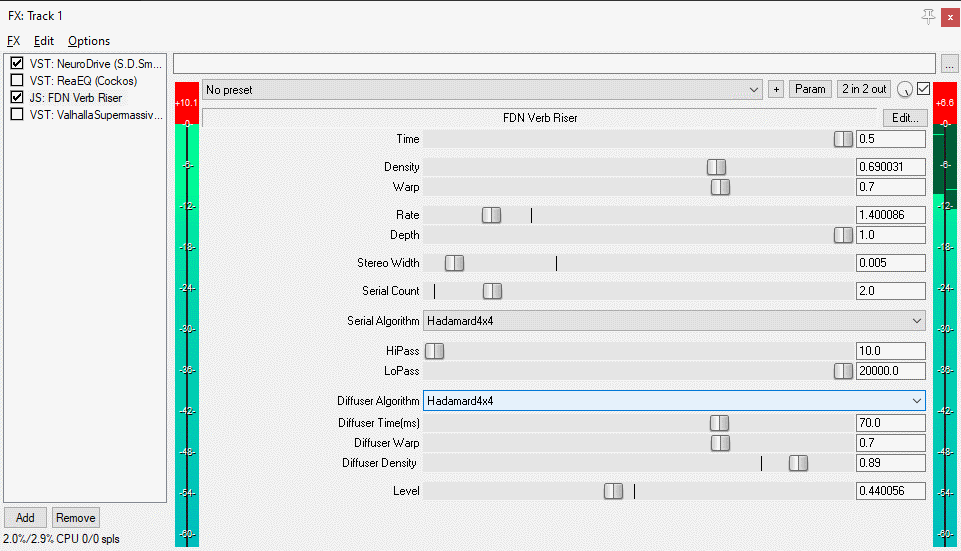

# FDN-Reverb-Riser
Simple work in progress FDN slow attack reverb

This is a first pass attempt to get a slow attack reverb working

Written purely in Reaper JS

Contains
HouseHolder4x4,HouseHolder8x8,Householder12x12,Hadamard2x2,Hadamard4x4 and Hadamard8x8 matrices to play around with

Currently the Best Slow attack Settings are:

sound like total crap at short time lengths!
