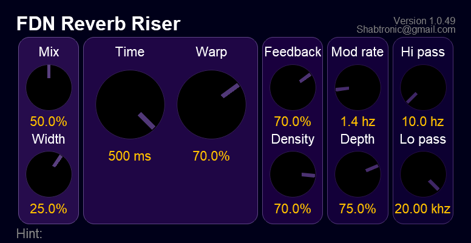

# FDN-Reverb-Riser
Simple work in progress FDN slow attack reverb

This is the second pass attempt to get a slow attack reverb working

Written purely in Reaper JS

currently using a small UI/DSP lib: https://github.com/shabtronic/ReaperJSLib

Some sound examples here:

https://soundcloud.com/shabtronica/sets/fdn-slow-attack-comparision

Development thread:

https://www.kvraudio.com/forum/viewtopic.php?f=33&t=547140
