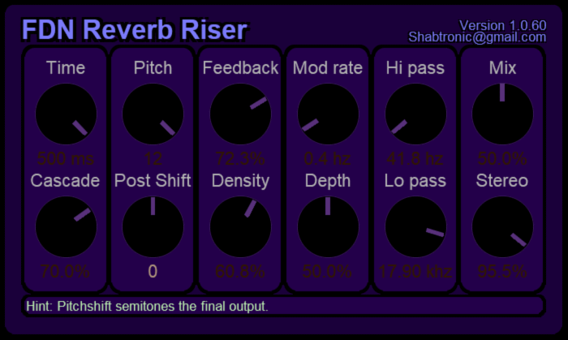

# FDN-Reverb-Riser

**Info:**

Simple FDN slow attack reverb with shimmer feedback loop

The current algorithm topology is:

**8 Serial Allpass filters in a feedback loop with Modulation,EQ and PitchShifting - into a 4x4 FDN matrix**

FDN is based on the works from

REDUCING ARTIFICIAL REVERBERATION ALGORITHM REQUIREMENTS
USING TIME-VARIANT FEEDBACK DELAY NETWORKS
By
Jasmin Frenette 

http://pages.infinit.net/jfrenett/thesis.pdf

Written purely in Reaper JS

currently using a small UI/DSP lib: https://github.com/shabtronic/ReaperJSLib
 

## Presets

**Default**

  Medium hall type reverb.

 

**Chorus Detune**

  Poor mans chorus - sounds like a out of tune piano!

 

**Stereo Swell**

  Medium decay reverb - that pans across the stereo field.

 

**Event Horizon**

  The classic "Big Space" FDN sound - endless floaty space (almost).

 
 
**Orchestra Swell**

  My favourite preset - play with the feedback to control the harmonics and intensity of the swell.
  Works best with sounds that have low to medium harmonic content (nylon guitar, flute e.t.c.)
  
  

**Drum Rev**

  Small reverse rise, that works well with drums and gives a gated reverb effect.

 
 
 https://soundcloud.com/shabtronica/sets/fdn-reverb-presets

## Installation

Simply copy the three files:

FDN Verb Riser
FDN Verb Riser.rpl
stronic-lib.js-inc

into your \reaper\effects\ directory.

## Development thread:

https://www.kvraudio.com/forum/viewtopic.php?f=33&t=547140

## To do ##

Add some time change code - resample time, resample pitch or XFade sled - to smooth out any time changes.
